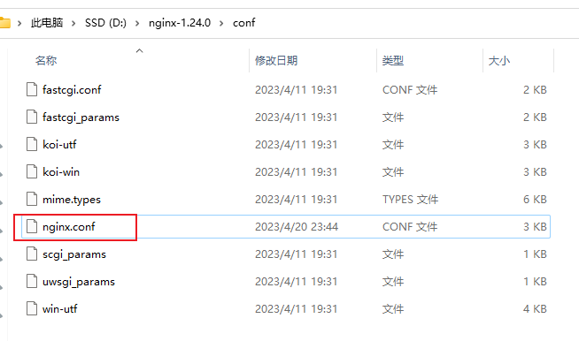

## nginx 配置

打开 nginx.conf 文件


``` nginx

#user  nobody;
worker_processes  1;

#error_log  logs/error.log;
#error_log  logs/error.log  notice;
#error_log  logs/error.log  info;

#pid        logs/nginx.pid;


events {
    worker_connections  1024;
}


http {
    include       mime.types;
    default_type  application/octet-stream;

    #log_format  main  '$remote_addr - $remote_user [$time_local] "$request" '
    #                  '$status $body_bytes_sent "$http_referer" '
    #                  '"$http_user_agent" "$http_x_forwarded_for"';

    #access_log  logs/access.log  main;

    sendfile        on;
    #tcp_nopush     on;

    #keepalive_timeout  0;
    keepalive_timeout  65;

    #gzip  on;

    server {
        listen       80;
        server_name  localhost;

        #charset koi8-r;

        #access_log  logs/host.access.log  main;

        location / {
            root   html;
            index  index.html index.htm;
        }

        #error_page  404              /404.html;

        # redirect server error pages to the static page /50x.html
        #
        error_page   500 502 503 504  /50x.html;
        location = /50x.html {
            root   html;
        }

        # proxy the PHP scripts to Apache listening on 127.0.0.1:80
        #
        #location ~ \.php$ {
        #    proxy_pass   http://127.0.0.1;
        #}

        # pass the PHP scripts to FastCGI server listening on 127.0.0.1:9000
        #
        #location ~ \.php$ {
        #    root           html;
        #    fastcgi_pass   127.0.0.1:9000;
        #    fastcgi_index  index.php;
        #    fastcgi_param  SCRIPT_FILENAME  /scripts$fastcgi_script_name;
        #    include        fastcgi_params;
        #}

        # deny access to .htaccess files, if Apache's document root
        # concurs with nginx's one
        #
        #location ~ /\.ht {
        #    deny  all;
        #}
    }


    # another virtual host using mix of IP-, name-, and port-based configuration
    #
    #server {
    #    listen       8000;
    #    listen       somename:8080;
    #    server_name  somename  alias  another.alias;

    #    location / {
    #        root   html;
    #        index  index.html index.htm;
    #    }
    #}


    # HTTPS server
    #
    #server {
    #    listen       443 ssl;
    #    server_name  localhost;

    #    ssl_certificate      cert.pem;
    #    ssl_certificate_key  cert.key;

    #    ssl_session_cache    shared:SSL:1m;
    #    ssl_session_timeout  5m;

    #    ssl_ciphers  HIGH:!aNULL:!MD5;
    #    ssl_prefer_server_ciphers  on;

    #    location / {
    #        root   html;
    #        index  index.html index.htm;
    #    }
    #}

}
```

### http 配置

``` nginx
location /test/ {
         proxy_pass http://127.0.0.1:5500/api/;
}
```

### ws 配置

## 斜杠问题

### 推荐使用

::: tip location 后面带 / proxy_pass 后面带 / proxy_pass 不带后缀

``` nginx
location /test/ {
         proxy_pass http://127.0.0.1:5500/;
}
```

:::
location 被替换
这种情况下 请求 /test/a => http://127.0.0.1:5500/a;

### 推荐使用

::: tip location 后面带 / proxy_pass 后面带 / proxy_pass 带后缀

``` nginx
location /test/ {
         proxy_pass http://127.0.0.1:5500/api/;
}
```

:::
location 被替换
这种情况下 请求 /test/a => http://127.0.0.1:5500/api/a;

### 可以使用

::: info location 后面带 / proxy_pass 后面不带 / proxy_pass 不带后缀

``` nginx
location /test/ {
         proxy_pass http://127.0.0.1:5500;
}
```

:::

location 不被替换
这种情况下 请求 /test/a => http://127.0.0.1:5500/test/a;
请求 /test123/a 不会被匹配上

### 谨慎使用

::: warning location 后面不带 / proxy_pass 后面也不带 / proxy_pass 不带后缀

``` nginx
location /test {
         proxy_pass http://127.0.0.1:5500;
}
```

:::
location 不会被替换
这种情况下 请求 /test/a => http://127.0.0.1:5500/test/a;
请求 /test123/a => http://127.0.0.1:5500/test123/a;

### 谨慎使用

::: warning location 后面不带 / proxy_pass 后面也不带 / proxy_pass 带后缀

``` nginx
location /test {
         proxy_pass http://127.0.0.1:5500/api;
}
```

:::
location 会被替换
这种情况下 请求 /test/a => http://127.0.0.1:5500/api/a;
请求 /test123/a => http://127.0.0.1:5500/api123/a;

### 不推荐使用

::: danger location 后面带 / proxy_pass 后面不带 / proxy_pass 带后缀

``` nginx
location /test/ {
         proxy_pass http://127.0.0.1:5500/api;
}
```

:::
location 被替换
这种情况下 请求 /test/a => http://127.0.0.1:5500/apia;
请求 /test123/a 不会被匹配上

### 错误使用

::: danger

location 后面不带 /
proxy_pass 后面带 /
proxy_pass 不带后缀

``` nginx
location /test {
         proxy_pass http://127.0.0.1:5500/;
}
```

:::

location 被替换
这种情况下 请求 /test/a => http://127.0.0.1:5500//a;
多了/ 不可取！

### 错误使用

::: danger
location 后面不带 /
proxy_pass 后面带 /
proxy_pass 带后缀

``` nginx
location /test {
         proxy_pass http://127.0.0.1:5500/aaa/;
}
```

:::
location 被替换 这种情况下 请求 /test/a => http://127.0.0.1:5500/aaa//a;
多了/ 不可取！
