## 下载

[jenkins](https://www.jenkins.io/download/)

## 安装

::: tip 需要安装 jdk
jdk 安装教程参考[这里](../jdk/)
:::

<!-- 第一步：下载jenkins
第二步：解压jenkins
第三步：启动jenkins
第四步：访问jenkins
第五步：安装插件
第六步：创建任务
第七步：配置任务
第八步：构建任务 -->

### 1. 双击 jenkins.msi 安装

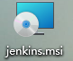

### 2. 点击下一步

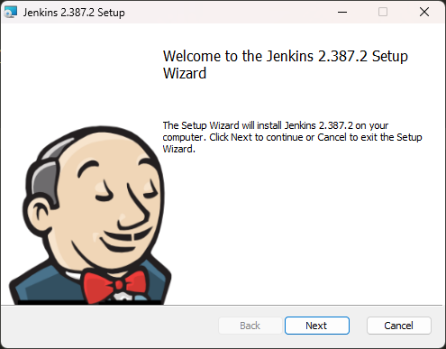

### 3. 选择安装路径

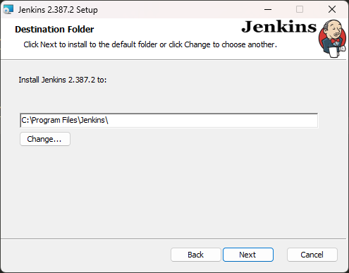

### 4. 输入电脑的用户名密码

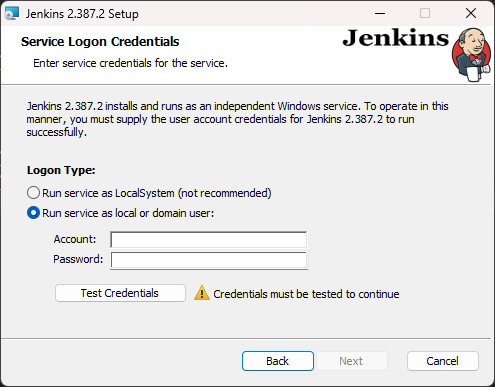

### 5. 点击 Test Credentials 测试用户名密码

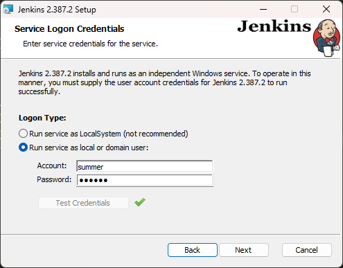

### 6. 选择启动端口，点击 Test Port 测试是否可用

### 7. 选择 Java 11-17 版本的

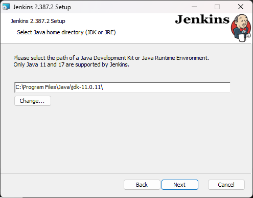

::: tip 需要安装 jdk
jdk 安装路径参考 C:\Program Files\Java\jdk-11.0.11\
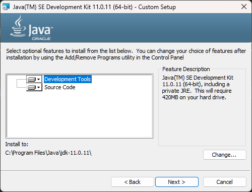
:::

### 8.下一步

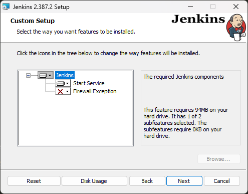

### 9.下一步

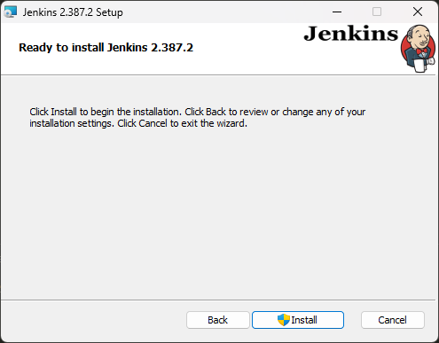

### 10.安装完成

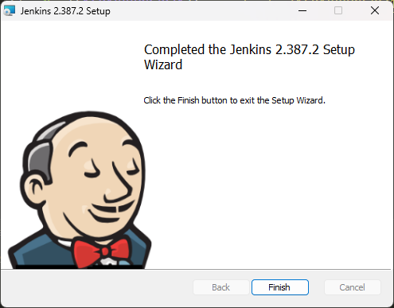

## 配置

### 打开管理页面端口号为安装时第 6 步选择的端口 (http://127.0.0.1:5678/),可以看到如下界面

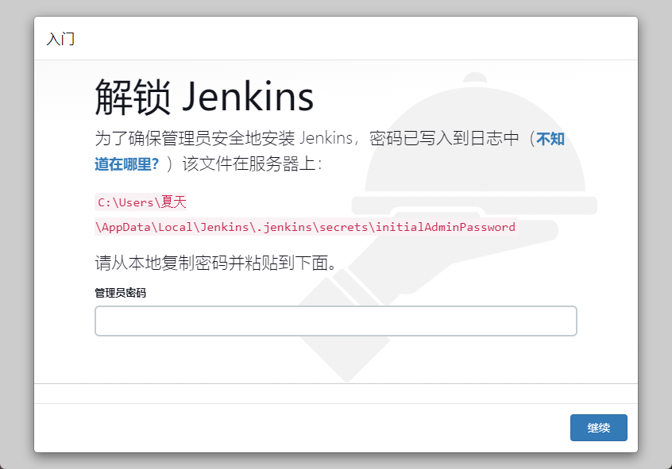

### 按提示打开文件

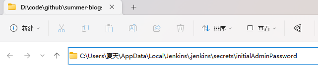

### 复制密码到输入框

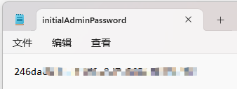

### 选择安装推荐的插件

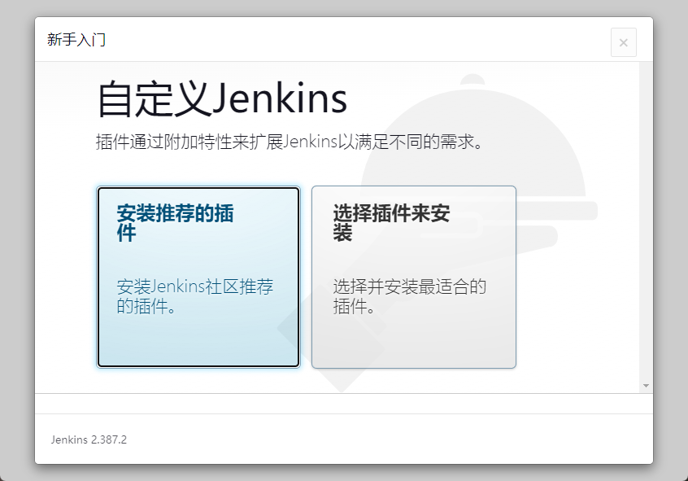

### 等待插件安装完成

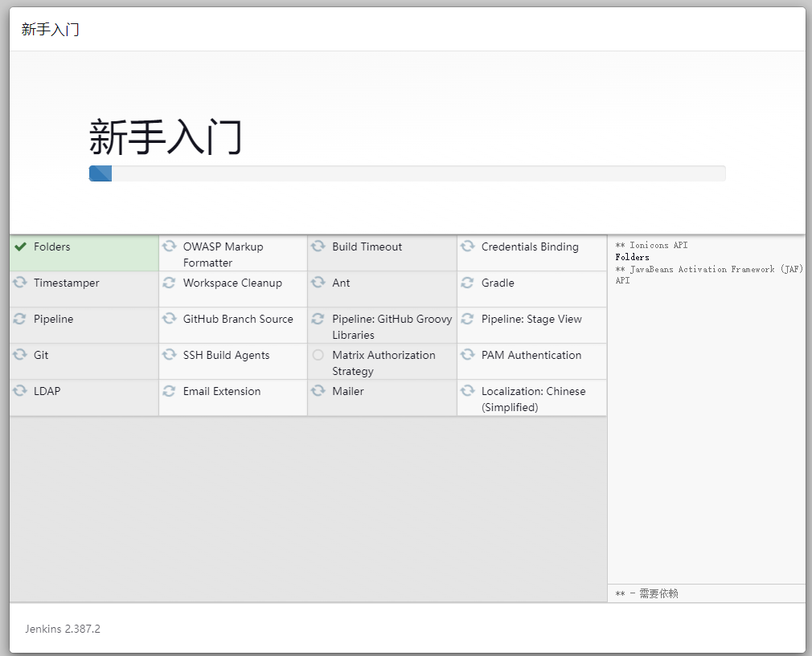

### 创建管理员帐号

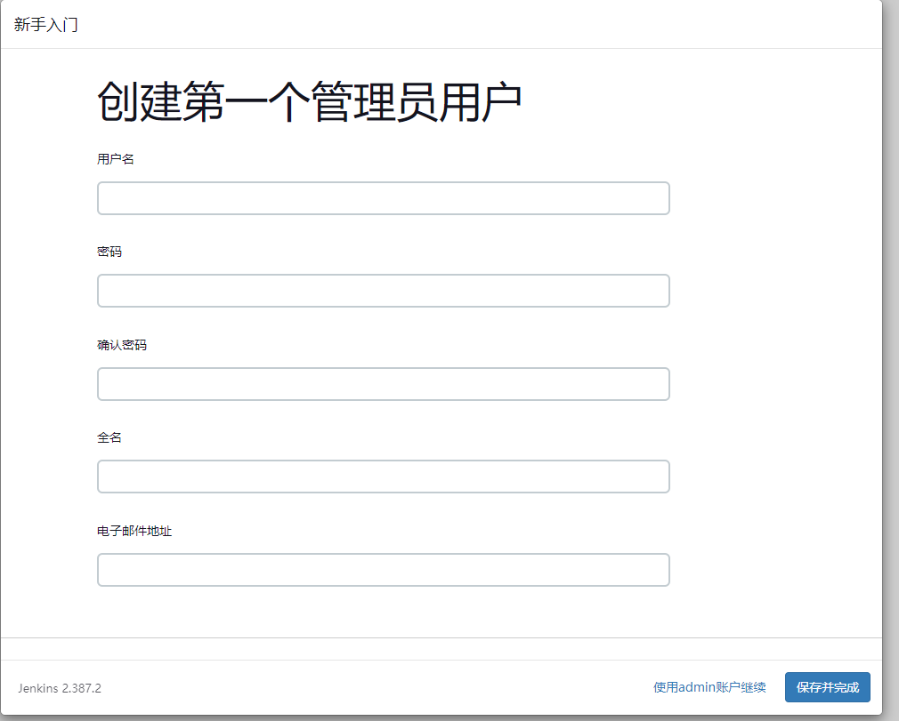

### 设置 Jenkins URL

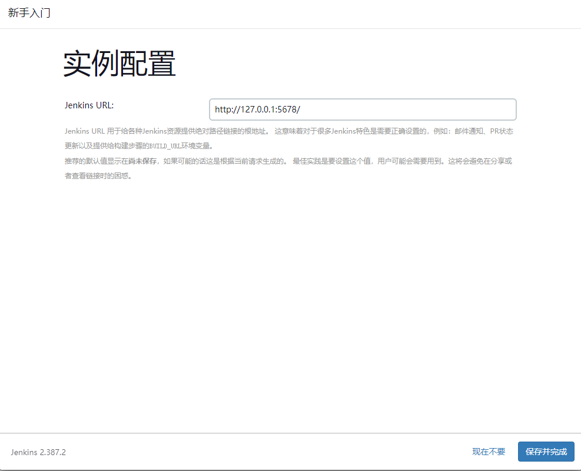

### 安装完成

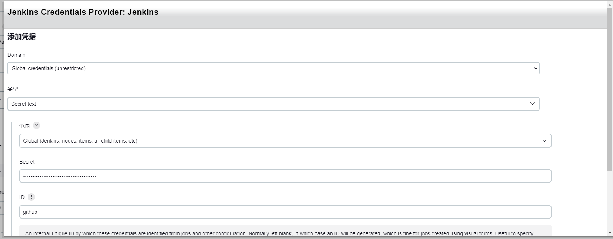