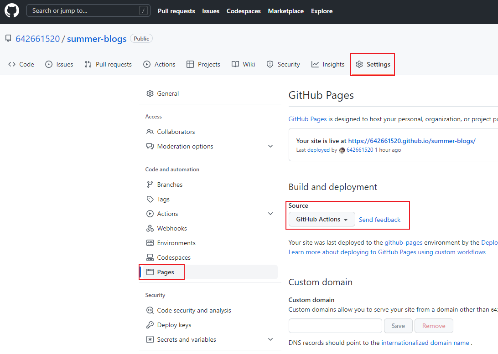

[VitePress](https://vitepress.dev/)

## 安装

::: code-group

```sh [npm]
$ npx vitepress init
```

```sh [pnpm]
$ pnpm exec vitepress init
```

:::

## 路由

```
index.md                  -->  /index.html (accessible as /)
prologue.md               -->  /prologue.html
guide/index.md            -->  /guide/index.html (accessible as /guide/)
guide/getting-started.md  -->  /guide/getting-started.html
```

::: warning 注意
由于/index.html 会被默认访问/ 导致编写侧边栏或者导航栏时如果 link 使用的是\*\*/index 则无法高亮
:::

## 部署

### 部署到 GitHubPage

1.如果你部署的站点为字路由，如 `https://642661520.github.io/summer-blogs/` 那么需要在 `.vitepress/config.js` 设置 base 为 `/summer-blogs/`

2.使用以下内容在项目的`deploy.yml`内部目录中创建一个名为的文件：`.github/workflows`
``` yaml
name: Deploy
on:
  workflow_dispatch: {}
  push:
    branches:
      - main #分支名称
jobs:
  deploy:
    runs-on: ubuntu-latest
    permissions:
      pages: write
      id-token: write
    environment:
      name: github-pages
      url: ${{ steps.deployment.outputs.page_url }}
    steps:
      - uses: actions/checkout@v3
        with:
          fetch-depth: 0
      - uses: actions/setup-node@v3
        with:
          node-version: 16
          cache: npm
      - run: npm ci
      - name: Build
        run: npm run docs:build
      - uses: actions/configure-pages@v2
      - uses: actions/upload-pages-artifact@v1
        with:
          path: docs/.vitepress/dist
      - name: Deploy
        id: deployment
        uses: actions/deploy-pages@v1

```
3.在`github`仓库`Settings`页面`Pages`菜单下，构建源选择`GitHub Actions`。

