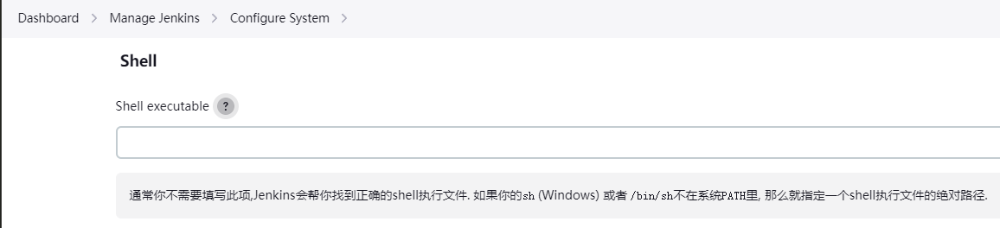
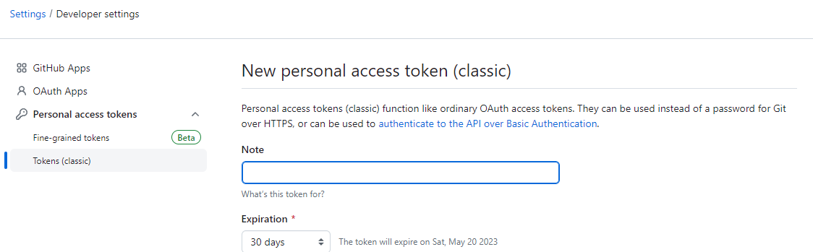
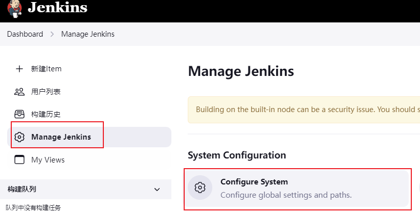
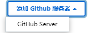
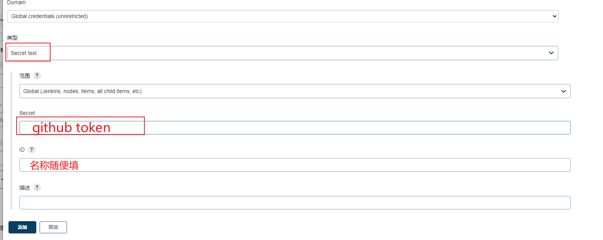
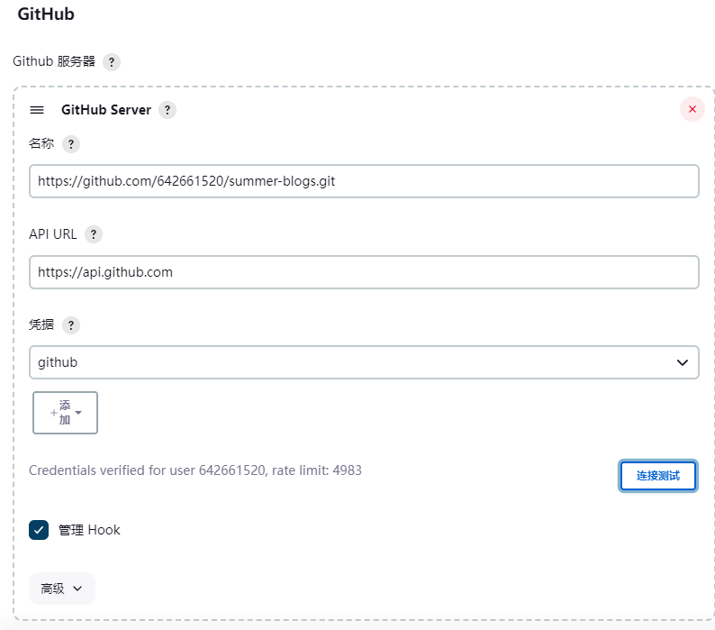

## 检查 shell 配置

### Dashboard=》Manage Jenkins=》Configure System

### 选择 shell

### 添加 sh 安装路径

一般为： `C:\Program Files\Git\bin\sh.exe`

### 选择保存

## 添加 git 服务器

### github

打开 github 的 tokens 设置页面 https://github.com/settings/tokens
创建一个新的 token

复制 token

打开 Manage Jenkins=》Configure System

找到 GitHub，选择添加 GitHub server

选择添加凭据

选择 Secret text，输入 ID 和 Secret，点击 添加

选择添加的凭据，输入 GitHub server API URL，点击 测试连接，成功后点击 保存

