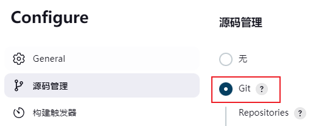
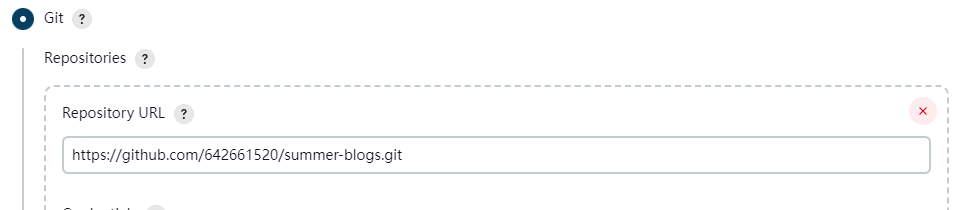
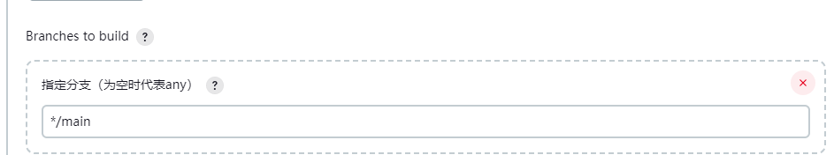
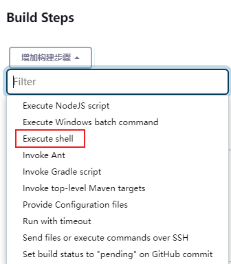
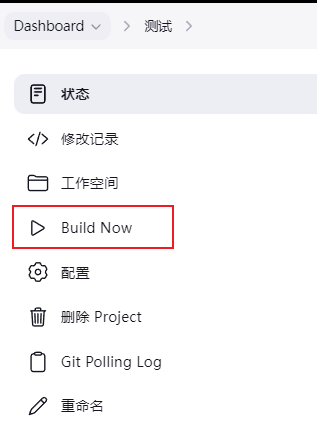
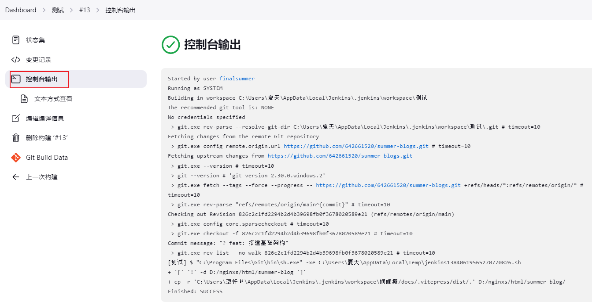
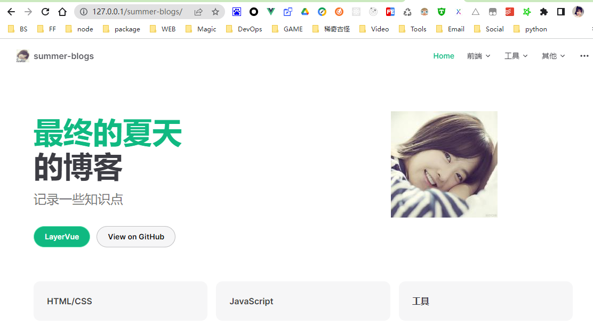

# 配置任务

下面以一个简单的项目为例，介绍如何配置任务。

## 1. 源码管理

### 1.1 选择 Git



### 1.2 输入仓库地址



### 1.3 选择分支



## 2. 构建触发器

有多种触发方式，这里只介绍定时构建的方式。

### 2.1 选择 Build periodically

### 2.2 输入定时表达式

H 1 \* \* \* 表示每天凌晨 1 点构建一次。

::: tip 定时表达式说明

\* \* \* \* \*

(五颗星，中间用空格隔开）

第一颗 \* 表示分钟，取值 0~59

第二颗 \* 表示小时，取值 0~23

第三颗 \* 表示一个月的第几天，取值 1~31

第四颗 \* 表示第几月，取值 1~12

第五颗 \* 表示一周中的第几天，取值 0~7，其中 0 和 7 代表的都是周日

1.每 30 分钟构建一次：H/30 \* \* \* \*

2.每 2 个小时构建一次：H H/2 \* \* \*

3.每天早上 8 点构建一次：H 8 \* \* \*

4.每天的 8 点，12 点，22 点，一天构建 3 次：0 8,12,22 \* \* \*
（多个时间点，中间用逗号隔开）
:::

## 3. 构建环境

## 4. 构建

### 4.1 选择 Execute shell



### 4.2 输入命令

```shell
#下载依赖
npm i
#执行打包命令
npm run docs:build
# 判断目标文件夹是否存在，不存在则创建
 if [ ! -d "D:/nginx-1.24.0/html/summer-blog" ]; then
  mkdir -p D:/nginx-1.24.0/html/summer-blog
 fi
# 复制构建后的文件到目标文件夹
cp -r $WORKSPACE/docs/.vitepress/dist/.  D:/nginx-1.24.0/html/summer-blog/
```

## 5. 构建后操作

## 6. 保存

## 7. 构建

### 点击Build Now



### 查看控制台输出



``` shell
Started by user finalsummer
Running as SYSTEM
Building in workspace C:\Users\夏天\AppData\Local\Jenkins\.jenkins\workspace\测试
The recommended git tool is: NONE
No credentials specified
 > git.exe rev-parse --resolve-git-dir C:\Users\夏天\AppData\Local\Jenkins\.jenkins\workspace\测试\.git # timeout=10
Fetching changes from the remote Git repository
 > git.exe config remote.origin.url https://github.com/642661520/summer-blogs.git # timeout=10
Fetching upstream changes from https://github.com/642661520/summer-blogs.git
 > git.exe --version # timeout=10
 > git --version # 'git version 2.30.0.windows.2'
 > git.exe fetch --tags --force --progress -- https://github.com/642661520/summer-blogs.git +refs/heads/*:refs/remotes/origin/* # timeout=10
 > git.exe rev-parse "refs/remotes/origin/main^{commit}" # timeout=10
Checking out Revision 826c2c1fd2294b2d4b39698fb0f3678020589e21 (refs/remotes/origin/main)
 > git.exe config core.sparsecheckout # timeout=10
 > git.exe checkout -f 826c2c1fd2294b2d4b39698fb0f3678020589e21 # timeout=10
Commit message: "? feat: 搭建基础架构"
 > git.exe rev-list --no-walk 826c2c1fd2294b2d4b39698fb0f3678020589e21 # timeout=10
[测试] $ "C:\Program Files\Git\bin\sh.exe" -xe C:\Users\夏天\AppData\Local\Temp\jenkins13840619565270770826.sh
+ '[' '!' -d D:/nginxs/html/summer-blog ']'
+ cp -r 'C:\Users\澶忓ぉ\AppData\Local\Jenkins\.jenkins\workspace\娴嬭瘯/docs/.vitepress/dist/.' D:/nginxs/html/summer-blog/
Finished: SUCCESS
```

### 查看目标网页

访问目标网页，可以看到已经部署成功啦！
