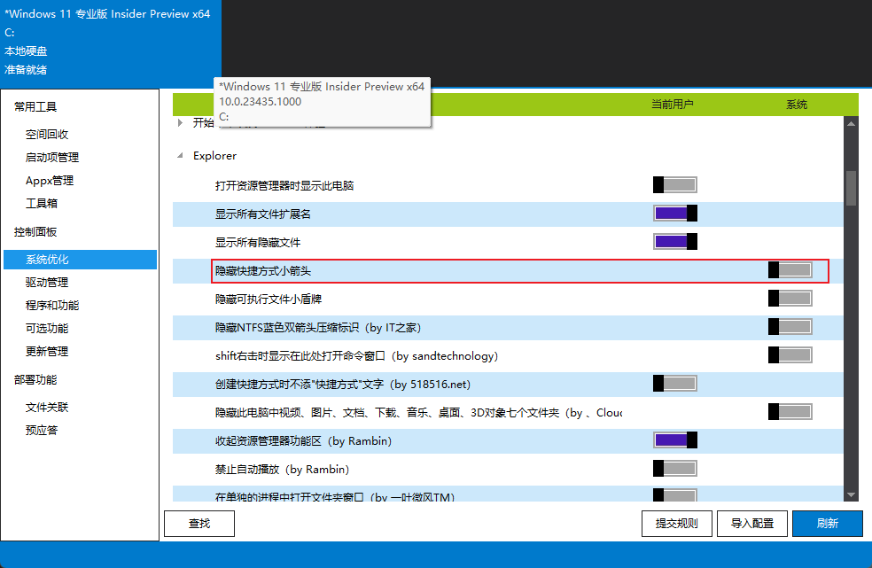
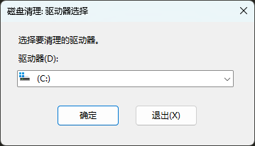
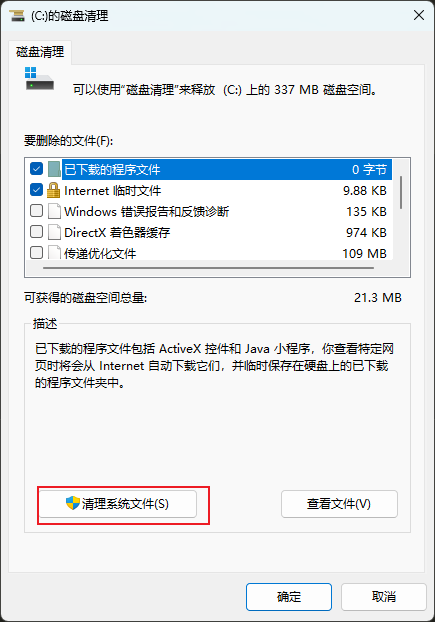
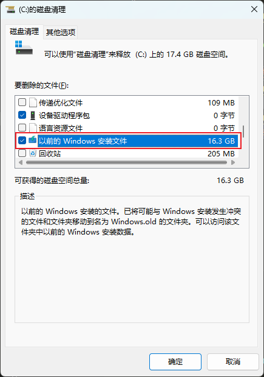
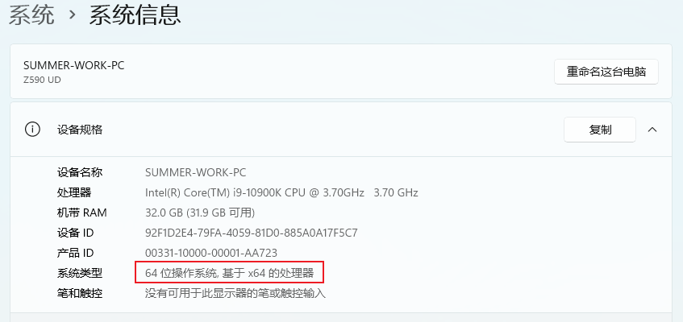

## 去除快捷方式小箭头

### Dism++

## 如何删除 window.old

1.在开始菜单搜索 `磁盘清理`
 2.选择 `清理系统文件`
 3.勾选 `以前的Windows安装文件`

## github 上提供的软件包这么多选哪个

github 提供的软件包主要针对不同的系统分有三种类型；

-386：意思就是电脑 CPU 的指令集架构是 X86；也就是 32 位了常说的 32 位系统；

-amd64：意思就是电脑 CPU 的指令集架构是 X64；也就是 64 位了常说的 64 位系统；

-arm64：也就是 arm 架构的 cpu 了，现在创听到的有高通骁龙 cpu。

如何查看电脑的架构？

windows 系统的话就右击我的电脑属性里查看；

linux 系统就使用命令：uname -a 查看；

| 输出  | 对应架构 |
| :---: | :------: |
|  x86  |   i386   |
|  x64  |  amd64   |
| ARM64 |  ARM64   |
